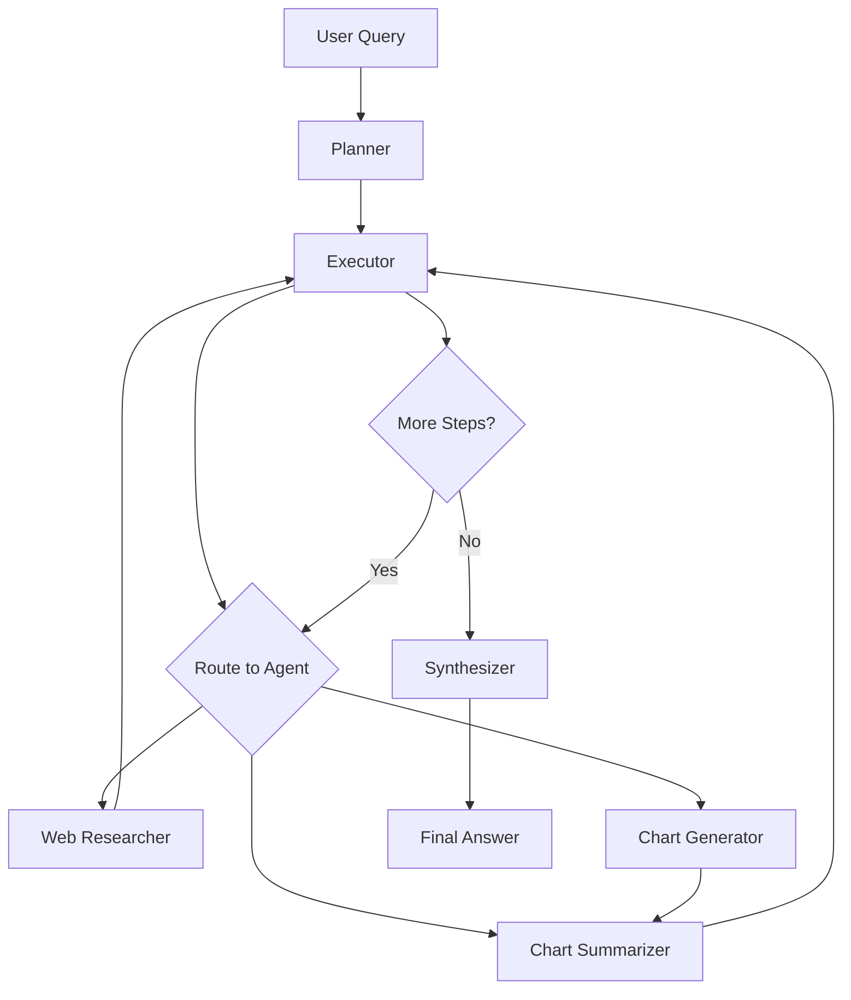

# Multi-Agent Workflow System 

## 📋 Overview

This notebook implements a sophisticated multi-agent workflow system using LangGraph and LangChain. The system orchestrates multiple specialized AI agents to perform web research, data analysis, chart generation, and answer synthesis - all working together to provide comprehensive responses to user queries.

## 🎯 Key Features

- **Multi-Agent Architecture**: Modular system with specialized agents for different tasks
- **Dynamic Planning**: Automatic generation and execution of step-by-step plans
- **Web Research**: Real-time information gathering using Tavily API
- **Data Visualization**: Automatic chart generation from extracted data
- **Intelligent Synthesis**: Comprehensive answer generation from multiple sources
- **Error Resilience**: Built-in fallbacks and mock data for testing

## 🏗️ Architecture

### Agents in the System

1. **Planner Agent** 🎯
   - Creates step-by-step execution plans
   - Assigns tasks to appropriate agents
   - Supports replanning if steps fail

2. **Executor Agent** 🎮
   - Orchestrates workflow execution
   - Routes tasks to appropriate agents
   - Manages state transitions

3. **Web Researcher Agent** 🔍
   - Performs web searches using Tavily API
   - Extracts relevant information
   - Formats search results for processing

4. **Chart Generator Agent** 📊
   - Creates data visualizations
   - Extracts numerical data from text
   - Generates professional charts with matplotlib

5. **Chart Summarizer Agent** 📝
   - Analyzes generated charts
   - Extracts key insights
   - Provides concise summaries

6. **Synthesizer Agent** 🎨
   - Combines all gathered information
   - Creates comprehensive final answers
   - Ensures response relevance to user query

## 📦 Requirements

### Python Packages
```
python-dotenv==1.2.1
langchain==0.2.0
langchain-openai==0.1.7
langchain-community==0.2.0
tavily-python==0.5.0
langgraph==0.1.0
matplotlib==3.9.2
pandas==2.2.3
seaborn==0.13.2
```

### API Keys Required
- **OpenAI API Key**: For LLM operations (GPT-4)
- **Tavily API Key**: For web search capabilities

## 🚀 Quick Start

### 1. Environment Setup

Create a `.env` file in the notebook directory:

```bash
# .env file
OPENAI_API_KEY=your-openai-api-key-here
TAVILY_API_KEY=your-tavily-api-key-here
```

### 2. Install Dependencies

Run the first cell to install all required packages:

```python
%pip install -q python-dotenv
%pip install -q langchain==0.2.0
%pip install -q langchain-openai==0.1.7
# ... (all other dependencies)
```

### 3. Run the Notebook

Execute cells sequentially to:
1. Initialize the state system
2. Define agent nodes
3. Build the workflow graph
4. Execute queries

## 💡 Usage Examples

### Example 1: Financial Data Visualization
```python
query = "Chart the current market capitalization of the top 5 banks in the US?"
state = {
    "messages": [HumanMessage(content=query)],
    "user_query": query,
    "enabled_agents": ["web_researcher", "chart_generator", 
                       "chart_summarizer", "synthesizer"],
}
result = graph.invoke(state)
```

### Example 2: Regulatory Research
```python
query = "Identify current regulatory changes for the financial services industry in the US."
state = {
    "messages": [HumanMessage(content=query)],
    "user_query": query,
    "enabled_agents": ["web_researcher", "chart_generator", 
                       "chart_summarizer", "synthesizer"],
}
result = graph.invoke(state)
```

## 🔄 Workflow Process



## 🎚️ State Management

The system uses a shared state that includes:

```python
class State(MessagesState):
    user_query: str           # Original user question
    enabled_agents: List[str] # Active agents for this query
    plan: List[Dict]          # Execution plan steps
    current_step: int         # Current execution position
    agent_query: str          # Current task instruction
    last_reason: str          # Execution decision reasoning
    replan_flag: bool         # Trigger for replanning
    replan_attempts: Dict     # Tracking replan attempts
    final_answer: str         # Synthesized final response
```

## 🛠️ Customization

### Modifying Agents

You can customize agent behavior by modifying their node functions:

```python
def custom_agent_node(state: State) -> Command:
    # Your custom logic here
    return Command(
        update={"messages": [HumanMessage(content=result)]},
        goto="next_agent"
    )
```

### Adding New Agents

1. Create a new node function
2. Add it to the workflow
3. Include it in the `enabled_agents` list

```python
workflow.add_node("custom_agent", custom_agent_node)
```

## 🔍 Debugging

### Enable Verbose Logging
The notebook includes print statements for tracking execution:
- Planner decisions
- Executor routing
- Agent actions
- Final synthesis

### Mock Data Mode
The system includes mock data fallbacks for testing without API keys:
- Mock search results for web researcher
- Default chart data for visualization
- Sample responses for testing workflow

## ⚠️ Common Issues & Solutions

### Issue: API Key Errors
**Solution**: Ensure your `.env` file is in the correct location and contains valid keys

### Issue: Chart Generation Fails
**Solution**: The system will use default data if extraction fails - check data format in messages

### Issue: Tavily Search Errors
**Solution**: Mock data will be used automatically; check API key and rate limits

### Issue: Graph Visualization Error
**Solution**: The notebook will display available nodes if visualization fails

## 📊 Performance Notes

- **Execution Time**: Queries typically take 2-5 minutes
- **API Calls**: Each query may make multiple LLM and search API calls
- **Rate Limits**: Be aware of OpenAI and Tavily API rate limits

## 🤝 Contributing

To improve this notebook:
1. Test with various query types
2. Add new specialized agents
3. Enhance error handling
4. Optimize prompt engineering
5. Add more visualization options

## 📄 License

This notebook is part of an educational course on multi-agent systems with LangChain and LangGraph.

## 📚 Additional Resources

- [LangChain Documentation](https://docs.langchain.com/)
- [LangGraph Documentation](https://github.com/langchain-ai/langgraph)
- [Tavily API Documentation](https://tavily.com/docs)
- [OpenAI API Documentation](https://platform.openai.com/docs)

## 🆘 Support

For issues or questions:
1. Check the error messages in notebook output
2. Verify API keys are correctly set
3. Ensure all dependencies are installed
4. Try with mock data first to test workflow
5. Review the FIXES_SUMMARY.md for recent updates

---

**Note**: This is an educational implementation demonstrating multi-agent orchestration concepts. Production deployments should include additional error handling, security measures, and optimization.
